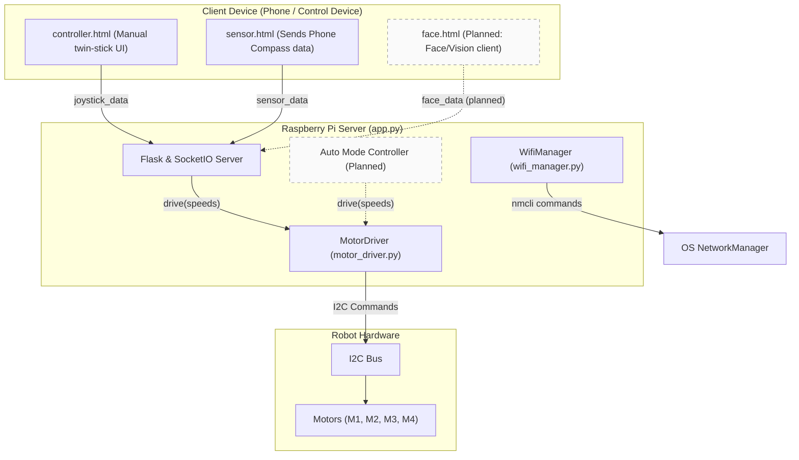
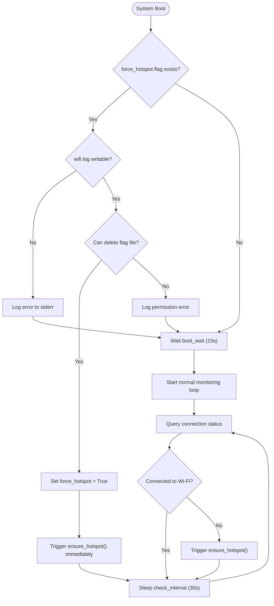

# Robot Twin Stick Controller

4 mecanum wheel robot controlled by a twin stick controller UI.


## System Architecture



## Getting Started

### Prerequisites

* Python 3.7+
* Hardware:
    * Raspberry Pi Zero 2 W with the default Raspbian
    * Motor Bonnet
    * Mecanum wheels (4 total, 2 of each type)
    * USB Battery pack
    * USB PD (Power Delivery) Decoy Trigger (set to 9V)
    * IMU (optional) or Android Phone (Pixel 4 etc.) for compass
    * Some sort of frame: model included <br/> 

### System Dependencies (Raspberry Pi)

For hardware access on Raspberry Pi:

```bash
sudo raspi-config nonint do_i2c 0
```

**Wi-Fi Management:**
The robot uses `nmcli` (NetworkManager) to manage connections. Ensure it is installed:

```bash
sudo apt install network-manager
```

Then run the script in [AGENTS.md](AGENTS.md).

### Wi-Fi Fallback Mode

If the robot cannot connect to a known Wi-Fi network on boot, it will create a Hotspot:

* **SSID:** `RobotHotspot`
* **Password:** `password`
* **IP:** `10.42.0.1` (usually)


Connect your phone to this hotspot, then visit:
`http://10.42.0.1:5000/wifi`

From there, you can scan for networks and configure the robot to connect to a new location.



#### Forcing Hotspot Mode

There are two easy ways to force the robot into Hotspot mode:

1. **Web UI Button (Instant Switch):** Visit `https://<ip>:5000/wifi` while connected and click the **"Switch to Hotspot"** button. The robot instantly switches to `RobotHotspot` mode without requiring a reboot, and writes `force_hotspot.flag` for one-time boot persistence.
2. **Command / Flag File (One-Time Boot Force):** Touch `force_hotspot.flag` in the project root directory:
   ```bash
   touch force_hotspot.flag
   ```
   On the next boot, `wifi_monitor.py` will detect the flag, immediately delete it to prevent lockout loops, and boot straight into hotspot mode. On subsequent reboots, normal Wi-Fi auto-connect resumes.
   * **Permissions Note:** The Linux user running the robot service (defined as `User` in `robot.service`, typically `pi`) must have write/delete permissions in the project root directory to delete the flag file and log to `wifi.log`.

### Installation

1. Clone the repo.
2. Install Python dependencies:

```bash
make install
```

### Running the Robot

Start the server:

```bash
make run
```

Then visit `https://zero.local:5000/controller` on your phone.

### Auto-Start Service

To run the robot automatically on boot, see [AUTO_RUN.md](AUTO_RUN.md).

### Development & Mock Mode

By default, motor control supports mock execution via `force_mock.flag` or command line flags when hardware is disconnected.

For Wi-Fi management, `WifiManager` operates directly via `nmcli` without internal fake mock state branches. If `nmcli` is not installed (e.g. running locally on a non-Linux development laptop), `WifiManager` returns clean error status responses without crashing or corrupting state.

To force mock mode for motor drivers during local development:

1. Create a `force_mock.flag` file in the project root:
   ```bash
   touch force_mock.flag
   ```
2. Run the application (`make run` or `python3 app.py`).
3. The server detects the flag, deletes it, and runs motor drivers in mock mode for that session.


To lint the code:

```bash
make lint
```

### Testing

To test motor mappings (or check Mock output):

```bash
make test
```

## Hardware Setup

* **Power**: Set USB PD Trigger to 9V.
* **Layout**: Ensure Mecanum wheels form an 'X' pattern from the top.
* **Wiring**: Connect your 4 motor channels to terminals M1-M4. Run `python3 wiring_check.py` to interactively calibrate motor channel positions and spin directions without physically rewiring.


## Files

### Backend & Hardware

* `app.py`: Main Flask application. Handles SocketIO communication, robot state management, and HTTPS certificate
  generation.
* `motor_driver.py`: Hardware abstraction layer. Handles `adafruit-circuitpython-motorkit` interaction, configurable motor channel/direction mapping, and automatic Mock fallback.
* `wiring_check.py`: Interactive calibration wizard to test channels, assign motor positions and rotation directions, and generate `motor_config.json`.

### Frontend

* `templates/`
    * `controller.html`: The Twin-Stick Joystick UI structure.
    * `sensor.html`: The Sensor Client UI structure (for transmitting phone compass/accelerometer data).
* `static/js/`
    * `common.js`: Shared logic for SocketIO connection and UI status updates.
    * `controller.js`: Handles Nipple.js joystick input and transmission.
    * `sensor.js`: Handles DeviceOrientation/Motion events and permission requests (iOS support).

### Configuration

* `Makefile`: Shortcuts for common commands (`install`, `run`, `test`, `lint`).
* `motor_config.json`: Recorded channel mapping and direction inversion config (generated by `wiring_check.py`).
* `pyproject.toml`: Python dependency management and project configuration.
