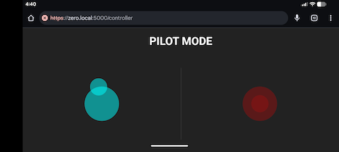
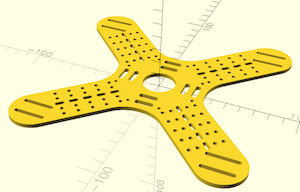

# Robot Twin Stick Controller

4 mecanum wheel robot controlled by a twin stick controller UI.



## Getting Started

### Prerequisites

* Python 3.7+
* Hardware:
    * Raspberry Pi Zero 2 W with the default Raspbian
    * Motor Bonnet
    * Mecanum wheels (4 total, 2 of each type)
    * USB Battery pack
    * USB PD (Power Delivery) Decoy Trigger (set to 9V)
    * IMU (optional) or Android Phone (Pixel 4 etc.) for compass
    * Some sort of frame: model included <br/> 

### System Dependencies (Raspberry Pi)

For hardware access on Raspberry Pi:

```bash
sudo raspi-config nonint do_i2c 0
```

Then run the script in [AGENTS.md](AGENTS.md).

### Installation

1. Clone the repo.
2. Install Python dependencies:

```bash
make install
```

### Running the Robot

Start the server:

```bash
make run
```

Then visit `https://zero.local:5000/controller` on your phone.

### Auto-Start Service

To run the robot automatically on boot, see [AUTO_RUN.md](AUTO_RUN.md).

### Development

If you run this project on a machine without the Motor Bonnet (e.g., your laptop), it will automatically fallback to **Mock Mode**.
In Mock Mode, motor commands are printed to the console instead of trying to talk to I2C hardware.

To lint the code:

```bash
make lint
```

### Testing

To test motor mappings (or check Mock output):

```bash
make test
```

## Hardware Setup

* **Power**: Set USB PD Trigger to 9V.
* **Layout**: Ensure Mecanum wheels form an 'X' pattern from the top.
* **Wiring**:
    * M1 (Front Left) → Motor Terminal 1
    * M2 (Front Right) → Motor Terminal 2
    * M3 (Back Left) → Motor Terminal 3
    * M4 (Back Right) → Motor Terminal 4

## Files

### Backend & Hardware
* `app.py`: Main Flask application. Handles SocketIO communication, robot state management, and HTTPS certificate generation.
* `motor_driver.py`: Hardware abstraction layer. Handles `adafruit-circuitpython-motorkit` interaction and automatic Mock fallback.
* `wiring_check.py`: Utility script to verify motor wiring interactively.

### Frontend
* `templates/`
    * `controller.html`: The Twin-Stick Joystick UI structure.
    * `sensor.html`: The Sensor Client UI structure (for transmitting phone compass/accelerometer data).
* `static/js/`
    * `common.js`: Shared logic for SocketIO connection and UI status updates.
    * `controller.js`: Handles Nipple.js joystick input and transmission.
    * `sensor.js`: Handles DeviceOrientation/Motion events and permission requests (iOS support).

### Configuration
* `Makefile`: Shortcuts for common commands (`install`, `run`, `test`, `lint`).
* `pyproject.toml`: Python dependency management and project configuration.
