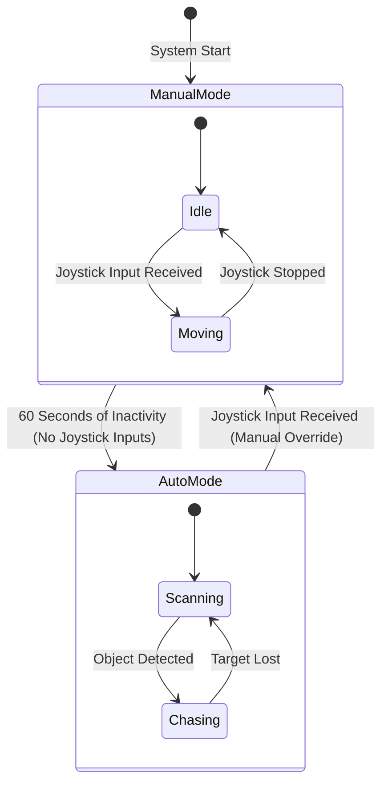

# Robot Personality & Autonomous Vision Design

## Overview

This document describes the design for the robot's "Personality" system, which uses a permanently mounted Android phone
to act as the robot's face, sensor package, and autonomous brain.

The system adds expressiveness via an animated eye display and enables autonomous "chasing" behavior using web-based
computer vision, while maintaining a safety override for manual control.

## Hardware Setup

- **Device:** Android Phone (permanent fixture).
- **Mount:** Forward-facing, displaying the screen to the world (acting as "Eyes") and using the rear camera for vision.
- **Connectivity:** Connected to the robot's local Wi-Fi, accessing the web interface.

## Software Architecture

### 1. Unified Client Interface (`face.html`)

A single web page serves three distinct roles:

1. **The Face:** Displays animated eyes (CSS/SVG) that react to robot state and look at detected objects.
2. **The Sensor:** Reads device IMU data (DeviceMotion/DeviceOrientation) for compass/gyro headers (replacing
   `sensor.html`).
3. **The Vision System:** Runs a local JavaScript Object Detection model (TensorFlow.js / COCO-SSD) to detect people or
   objects.

### 2. Autonomous Logic (Client-Side)

- **Object Detection:** The phone captures video frames and processes them locally using TF.js.
- **Target Selection:** The logic selects the "most interesting" object (e.g., the largest "person" or a specific
  color).
- **Data Transmission:** The client sends a `face_data` packet to the backend ~100ms:
  ```json
  {
    "alpha": 120.5,       // Compass heading (from IMU)
    "beta": 10.2,         // Pitch (from IMU)
    "gamma": -5.0,        // Roll (from IMU)
    "vision": {
      "detected": true,
      "type": "person",
      "x": 0.5,           // Normalized X center (0.0 - 1.0)
      "y": 0.4,           // Normalized Y center (0.0 - 1.0)
      "size": 0.3         // Normalized area/height
    }
  }
  ```

### 3. Backend Logic (`app.py`)

The Python backend handles the "Safety Override" and kinematic control.

#### Safety Arbitration

- **Rule:** Human control via `/controller` always takes precedence.
- **Mechanism:**
    - A timestamp `last_human_command_time` is updated whenever a joystick event is received.
    - If `current_time - last_human_command_time < 60 seconds`:
        - **Manual Mode:** The robot ignores `vision` driving commands.
        - The `robot_status` broadcast includes `"mode": "manual"`.
    - If `current_time - last_human_command_time >= 60 seconds`:
        - **Autonomous Mode:** The robot calculates motor speeds based on `vision` data.
        - The `robot_status` broadcast includes `"mode": "auto"`.



#### Chasing Behavior (Auto Mode)

- **Turn:** Proportional control to center the object (Target X = 0.5).
- **Drive:** Proportional control to maintain a target size (e.g., move forward if size < 0.5, stop if close).

## Visual Personality

- **Idle/Manual Mode:** Eyes look around randomly or track the last known heading.
- **Auto Mode:** Eyes "lock on" to the detected object (tracking X/Y coordinates).
- **Reactions:**
    - Squint when moving fast.
    - Blink randomly.
    - Change color/shape based on "mode" (e.g., Blue for Manual, Red for Auto/Chasing).
